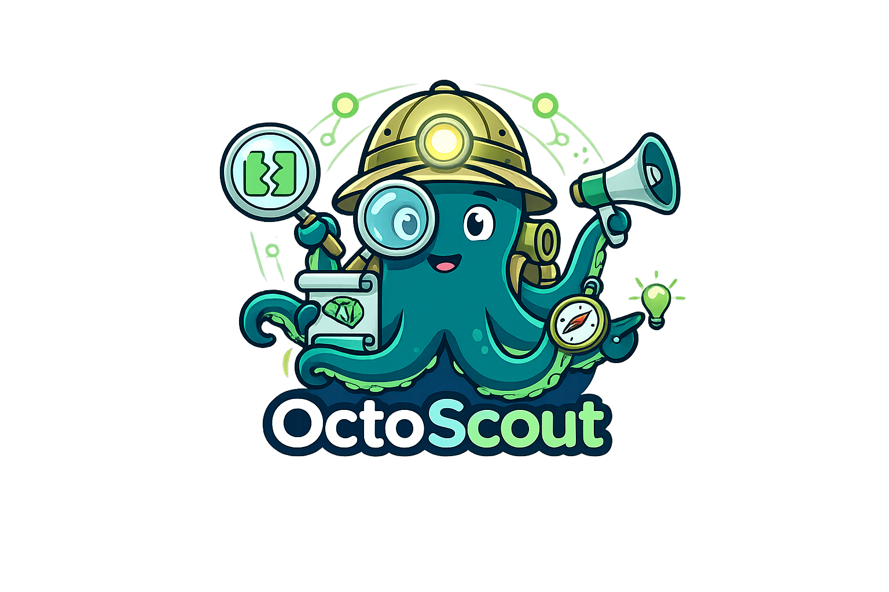

<div align="center">
  

  # OctoScout
  **LLM-Powered GitHub Issues Agent: Search, Ask, and Give Back**

  
  
  
</div>

Ever spent hours digging through thousands of GitHub Issues to debug a version incompatibility? OctoScout does that for you.

OctoScout is an LLM-powered agent that diagnoses Python/ML framework errors by analyzing tracebacks, detecting version incompatibilities, searching GitHub Issues, and building a compatibility matrix across the ML ecosystem.

## Features

**Diagnosis Agent** -- Paste a traceback, get a diagnosis with root cause, fix, and relevant issues.

```bash
octoscout diagnose "TypeError: Trainer.__init__() got an unexpected keyword argument 'tokenizer'"
```

- Direct mode (default): skips heuristic triage, goes straight to ReAct agent
- Pre-computed search suggestions from package-to-repo mapping (45+ packages)
- Offline compatibility matrix lookup + online GitHub Issues search
- Local API signature checking via `inspect`
- Automatic retry with exponential backoff on transient errors

**Compatibility Matrix** -- A database of known version-pair compatibility issues, built from 13,000+ GitHub issues across 9 major ML repos.

```bash
octoscout matrix query transformers==4.55.0 torch==2.3.0
octoscout matrix check --auto-env
octoscout matrix heatmap
```

- Interactive HTML heatmap visualization
- Covers: transformers, torch, vllm, peft, accelerate, DeepSpeed, flash-attention, trl, LLaMA-Factory
- Smart comment scoring to extract high-value solutions from issue discussions

**Community Features** -- Draft issues and suggest replies to help the community.

- Auto-draft GitHub issues when no solution exists
- Suggest replies to open issues with your solution
- Post directly to GitHub (with user confirmation)

**Claude Code Integration** -- Works as a Claude Code plugin with MCP server.

```bash
# Slash commands
/diagnose "your traceback here"
/matrix check

# MCP tools (auto-discovered by Claude Code)
octoscout_diagnose, octoscout_check_compatibility, octoscout_matrix_stats
```

## Quick Start

### Install

```bash
pip install -e .
```

### Set up API keys

```bash
# Anthropic API key (required for diagnosis)
export ANTHROPIC_API_KEY="sk-ant-..."

# GitHub token (recommended, for higher rate limits)
export GITHUB_TOKEN="ghp_..."
```

On Windows PowerShell:
```powershell
$env:ANTHROPIC_API_KEY = "sk-ant-..."
$env:GITHUB_TOKEN = "ghp_..."
```

### Diagnose an error

```bash
# From a string
octoscout diagnose "TypeError: Trainer.__init__() got an unexpected keyword argument 'tokenizer'"

# From a file
octoscout diagnose traceback.txt

# Piped from a failing script
python my_script.py 2>&1 | octoscout diagnose -

# With verbose agent reasoning
octoscout diagnose "..." --verbose
```

### Build the compatibility matrix

```bash
# 1. Crawl issues from GitHub
octoscout matrix crawl --all

# 2. Patch metadata (comment counts)
octoscout matrix patch-metadata --all

# 3. Enrich with scored comments
octoscout matrix enrich --all

# 4. Extract structured data via LLM
octoscout matrix extract --all

# 5. Build the matrix
octoscout matrix build

# 6. View as interactive heatmap
octoscout matrix heatmap
```

### Check your environment

```bash
octoscout matrix check --auto-env
```

## Architecture

```
User Input (traceback)
    |
    v
[Traceback Parser] --> [Environment Snapshot]
    |
    |  --direct (default)                --triage
    |                                       |
    v                                       v
[ReAct Agent Loop]                   [Heuristic Triage]
|-- check_compatibility (matrix)        |
|-- search_github_issues                |  local → Quick LLM
|-- get_issue_detail                    |  upstream → ReAct Loop
|-- check_api_signature                 |  ambiguous → ReAct Loop
|-- get_env_snapshot
|
v
[Synthesis + Report]
|
v
[Community: draft issue / suggest reply]
```

**Compatibility Matrix Pipeline:**

```
GitHub Issues API --> Crawler --> Pre-filter --> raw/*.jsonl
                                                    |
                              patch-metadata <------+
                                                    |
                              enrich (comments) <---+
                                                    |
                              LLM Extractor ------> extracted/*.jsonl
                                                    |
                              Aggregator ---------> matrix.json
                                                    |
                              Visualizer ---------> heatmap.html
```

## Project Structure

```
src/octoscout/
  cli.py              # CLI entry point (Typer)
  config.py           # Configuration (env vars, YAML, CLI args)
  models.py           # Core data models
  agent/              # ReAct diagnosis agent
  diagnosis/          # Traceback parsing, triage, local checks
  search/             # GitHub client, real-time search, version filter
  matrix/             # Crawler, extractor, aggregator, visualizer
  community/          # Issue drafter, reply suggester
  mcp/                # MCP server for Claude Code
  providers/          # LLM providers (Claude, OpenAI)
  prompts/            # Externalized prompt templates (.md files)
plugin/               # Claude Code plugin package
eval/                 # Evaluation framework
tests/                # 75 unit tests
```

## Configuration

OctoScout supports a priority chain: `defaults < config file < env vars < CLI args`.

Create `~/.octoscout/config.yaml`:

```yaml
llm_provider: claude
claude_model: claude-sonnet-4-6
github_token: ghp_...
matrix_data_dir: data/matrix
```

## Development

```bash
# Install with dev dependencies
pip install -e ".[dev]"

# Run tests
pytest tests/ -v

# Run linter
ruff check src/

# Run evaluation
python -m eval --category api_changes --verbose
```

## License

[MIT](LICENSE)
